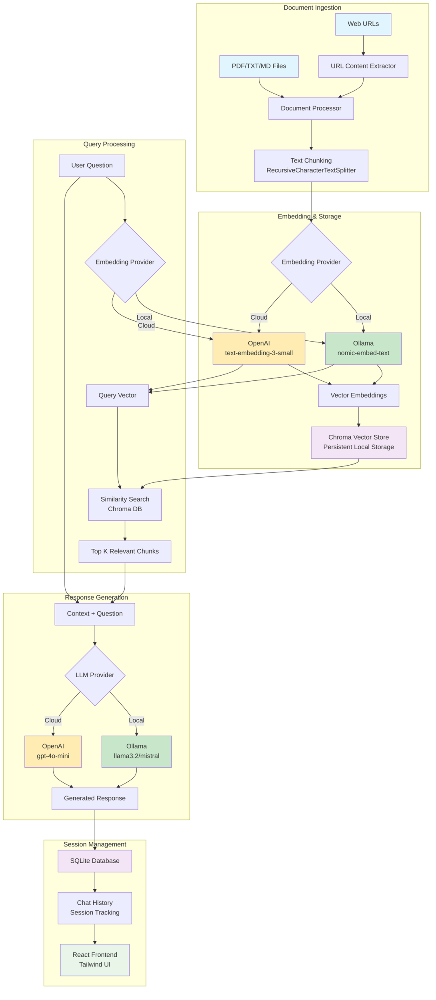

# Positron Docs - Simple Local RAG Interface

A **lightweight, privacy-first** document Q&A system designed for personal use with your local documents. Built for users who found existing enterprise and open-source RAG solutions overkill for their needs.

## About This Project

### 🏠 **Local-First Privacy**
- **Ollama Integration**: Run everything locally with open-source models - your documents never leave your machine
- **OpenAI Optional**: Use cloud models only when you choose to (understand that this shares data with OpenAI)
- **No Data Mining**: Your conversations and documents stay private

### ⚡ **Minimal & Efficient** 
- **Lightweight**: Unlike heavyweight enterprise solutions, this runs on minimal resources
- **Simple Setup**: Get running in minutes, not hours
- **Clean Interface**: Modern, intuitive UI without feature bloat

### 🎯 **Purpose-Built for Personal Use**
- **Document-Centric**: Designed specifically for interacting with your personal document collection
- **Local Ollama**: Perfect for users running local LLMs who value privacy and control
- **Flexible Deployment**: Works with both local (Ollama) and cloud (OpenAI) providers

## Features

- 📄 **Document Upload**: Support for PDF, TXT, and MD files
- 🌐 **URL Ingestion**: Extract content from web pages with optional PDF extraction
- 🔍 **Semantic Search**: Vector-based document search using Chroma
- 💬 **Chat Interface**: Interactive chat with document context
- 📊 **Session Management**: Track and resume chat sessions
- 🔌 **Flexible Providers**: Support for both Ollama (local) and OpenAI embeddings/LLMs
- 🎨 **Modern UI**: Clean React interface with Tailwind CSS

## Architecture & Data Pipeline



### Pipeline Explanation

**🔵 Document Ingestion**
- Accepts multiple input types (files, URLs)
- Processes and chunks documents for optimal retrieval

**🟢 Local Processing (Privacy-First)**
- Ollama embeddings and LLM keep everything on your machine
- No external API calls required

**🟡 Cloud Processing (Optional)**
- OpenAI integration for enhanced performance
- ⚠️ Data shared with OpenAI when enabled

**🟣 Storage & Memory**
- Chroma for vector storage (persistent, local)
- SQLite for chat history and metadata

## Privacy & Resource Considerations

### 🔒 **Privacy Models**

**Recommended: Full Local Setup (Maximum Privacy)**
- **Embeddings**: Ollama with `nomic-embed-text` model
- **LLM**: Ollama with `llama3.2` or similar local model
- **Result**: Zero data leaves your machine, complete privacy

**Hybrid Setup (Partial Privacy)**
- **Embeddings**: Local Ollama (documents stay private)
- **LLM**: OpenAI (only your questions are sent to OpenAI, not document content)

**Cloud Setup (Convenience over Privacy)**
- **Embeddings**: OpenAI (document content sent for embedding)
- **LLM**: OpenAI (full conversation shared)
- **⚠️ Warning**: This shares your document content and conversations with OpenAI

### 💻 **Resource Requirements**

**Minimal Setup (Recommended)**
- **RAM**: 8GB+ (4GB for Ollama + 2GB for embeddings + 2GB for system)
- **Storage**: ~5GB for models + your document storage
- **CPU**: Any modern processor (embedding is the main workload)

**Why This is Lighter**
- Simple setup (no complex orchestration needed)
- Lightweight vector database (straightforward Chroma setup)
- Focused feature set for personal use
- Optimized for single-user, local deployment

## Prerequisites

- Python 3.9+
- Node.js 20.17+
- Ollama (if using local models - **recommended for privacy**)

## Quick Start

### 1. Clone and Setup Environment

```bash
# Clone the repository
git clone <your-repo-url>
cd positron-docs

# Set up Python virtual environment
python3 -m venv .venv
source .venv/bin/activate  # On Windows: .venv\Scripts\activate

# Install Python dependencies
pip install -r requirements.txt
```

### 2. Configure Environment

```bash
# Copy environment template
cp .env.example .env

# Edit .env with your settings
# - Choose embedding provider (ollama or openai)
# - Set API keys if using OpenAI
# - Configure Ollama models if using local
```

### 3. Install Ollama Models (if using Ollama)

```bash
# Install embedding model
ollama pull nomic-embed-text

# Install chat model
ollama pull llama3.2
```

### 4. Start the Backend

```bash
# Activate virtual environment if not already active
source .venv/bin/activate

# Run the FastAPI backend
uvicorn app:app --reload
```

The backend will be available at http://localhost:8000

### 5. Start the Frontend

In a new terminal:

```bash
cd frontend
npm install
npm run dev
```

The frontend will be available at http://localhost:5173

## Project Structure

```
positron-docs/
├── app.py                 # Main FastAPI application
├── backend/
│   ├── config.py         # Configuration settings
│   ├── models.py         # Database and API models
│   ├── database.py       # Database setup
│   ├── embeddings.py     # Embedding providers
│   ├── vector_store.py   # Chroma vector store
│   ├── document_processor.py  # Document processing
│   └── llm.py           # LLM providers and chat engine
├── frontend/
│   ├── src/
│   │   ├── App.jsx      # Main React component
│   │   ├── api.js       # API client
│   │   └── index.css    # Tailwind styles
│   └── package.json
├── data/                 # Database and vector store
├── uploads/             # Uploaded documents
└── .env.example         # Environment template
```

## Usage

1. **Upload Documents**: Use the Upload tab to add PDF, TXT, or MD files
2. **Ingest URLs**: Enter a URL to extract and index web content
3. **Chat**: Ask questions about your documents in the Chat tab
4. **Search**: Find specific content across all documents
5. **Manage**: View and delete documents in the Documents tab

## API Endpoints

- `POST /api/upload` - Upload a document
- `POST /api/ingest_url` - Ingest content from URL
- `POST /api/chat` - Send chat message
- `GET /api/sessions` - List chat sessions
- `GET /api/sessions/{id}/messages` - Get session messages
- `POST /api/search` - Search documents
- `GET /api/documents` - List documents
- `DELETE /api/documents/{id}` - Delete document
- `GET /api/stats` - System statistics

## Configuration Options

### Embedding Providers

- **Ollama** (default): Local embeddings using models like `nomic-embed-text`
- **OpenAI**: Cloud-based embeddings using `text-embedding-3-*` models

### LLM Providers

- **Ollama**: Local models like `llama3.2`, `mistral`, etc.
- **OpenAI**: GPT models like `gpt-4o-mini`

### Storage

- **SQLite**: Document metadata and chat history
- **Chroma**: Vector embeddings with persistent disk storage

## Troubleshooting

### Backend Issues

```bash
# Check if Ollama is running (if using local models)
ollama list

# Verify Python dependencies
pip list

# Check logs
uvicorn app:app --reload --log-level debug
```

### Frontend Issues

```bash
# Clear npm cache
npm cache clean --force

# Reinstall dependencies
rm -rf node_modules package-lock.json
npm install
```

### Common Problems

1. **Ollama connection error**: Ensure Ollama is running (`ollama serve`)
2. **CORS errors**: Check that backend is running on port 8000
3. **Module not found**: Activate virtual environment before running backend
4. **npm permission errors**: Fix with `sudo chown -R $(whoami) ~/.npm`

## How is This Different?

### **vs. Other Open Source RAG Solutions**

| Feature | Positron Docs | Typical Enterprise RAG |
|---------|---------------|------------------------|
| **Setup Complexity** | `pip install` + `npm run dev` | Docker Compose with 10+ services |
| **Resource Usage** | ~6-8GB RAM | 16-32GB RAM |
| **Dependencies** | Python + Node.js + Ollama | Elasticsearch + Redis + PostgreSQL + Multiple microservices |
| **Privacy Control** | Full local with Ollama | Often requires cloud components |
| **Learning Curve** | 5 minutes to first chat | Hours of configuration |
| **Use Case** | Personal document interaction | Enterprise team collaboration |

### **When to Use Positron Docs**
✅ You want to chat with your personal documents  
✅ You value privacy and local control  
✅ You prefer simple, lightweight solutions  
✅ You're already using or interested in Ollama  
✅ You want something that "just works" without complexity  

### **When to Use Something Else**
❌ You need multi-user collaboration  
❌ You need enterprise security features  
❌ You need complex workflow automation  
❌ You have a team of developers to maintain complexity  

## Development

### Adding New Document Types

Edit `backend/document_processor.py` to add support for new file types.

### Customizing Chunking

Modify chunk size and overlap in `DocumentProcessor.__init__()`.

### Adding New Embedding Models

Extend `EmbeddingProvider` class in `backend/embeddings.py`.

## Core Philosophy

**"Simple, Private, Effective"**

This project was created for users who found existing RAG solutions too complex for personal document interaction. The goal is to provide:

1. **Simplicity First**: If you can't get it running in under 10 minutes, it's too complex
2. **Privacy by Default**: Your documents should stay on your machine unless you explicitly choose otherwise
3. **Resource Conscious**: Should run comfortably on a typical developer laptop
4. **Ollama Native**: Built with local LLMs in mind, cloud integration is secondary
5. **Personal Scale**: Optimized for individual use, not enterprise deployment

**Perfect for:**
- Researchers with personal document collections
- Developers wanting local code/documentation search
- Students organizing academic papers
- Anyone who values digital privacy
- Ollama enthusiasts wanting a practical RAG application

## Contributing

Contributions welcome! This project prioritizes:
- Maintaining simplicity over adding features
- Privacy-first design decisions
- Resource efficiency
- Clear, minimal code

## License

MIT License - See LICENSE file for details